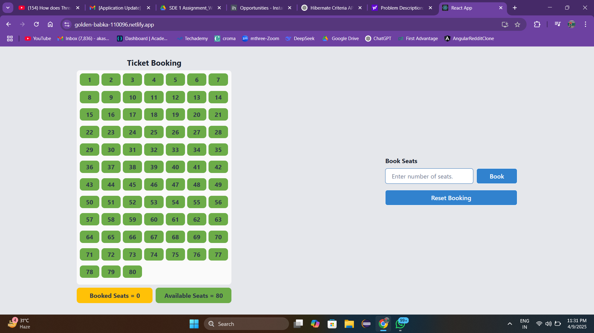
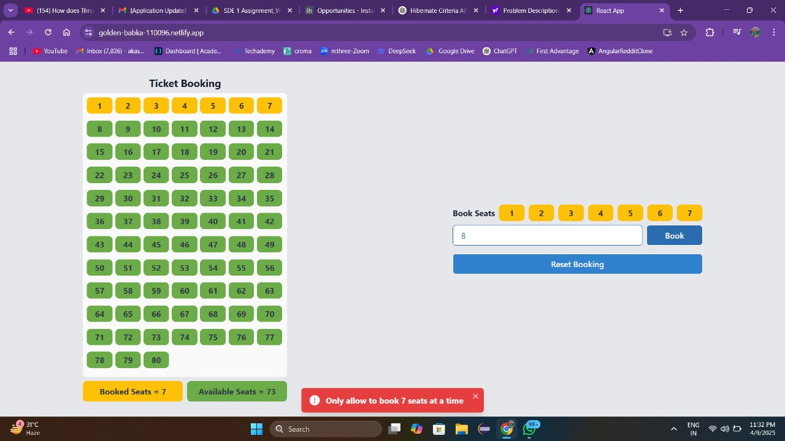
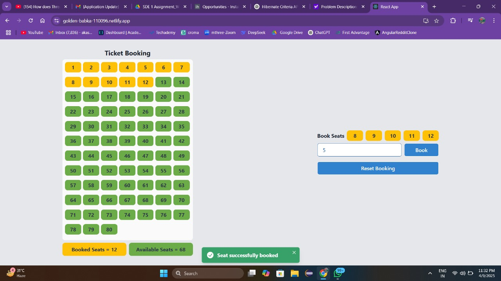

# Train Seat Booking

## Deployed App
https://golden-babka-110096.netlify.app/

## Problem Description:
- There are 80 seats in a coach of a train with only 7 seats in a row and last row of only 3 seats. For
simplicity, there is only one coach in this train.
- One person can reserve up to 7 seats at a time.
- If a person is reserving seats, the priority will be to book them in one row.
- If seats are not available in one row then the booking should be done in such a way that the nearby
seats are booked.
- User can book as many tickets as s/he wants until the coach is full.
- You don’t have to create login
functionality for this application

## Tech Stack
- React js
- Node js
- Express js
- MongoDB

## 🖼️ Screenshot
### First Screenshot

### Second Screenshot

### Third Screenshot

## Backend Installation
- clone repo
- cd backend
- npm install
- npm run dev

## Frontend Installation
- clone repo
- cd frontend
- npm install
- npm start

## API Endpoints
- GET /api/seats - get all seats
- POST /api/seats - reset all seats booking
- POST /api/seats/book - book n seats
  
